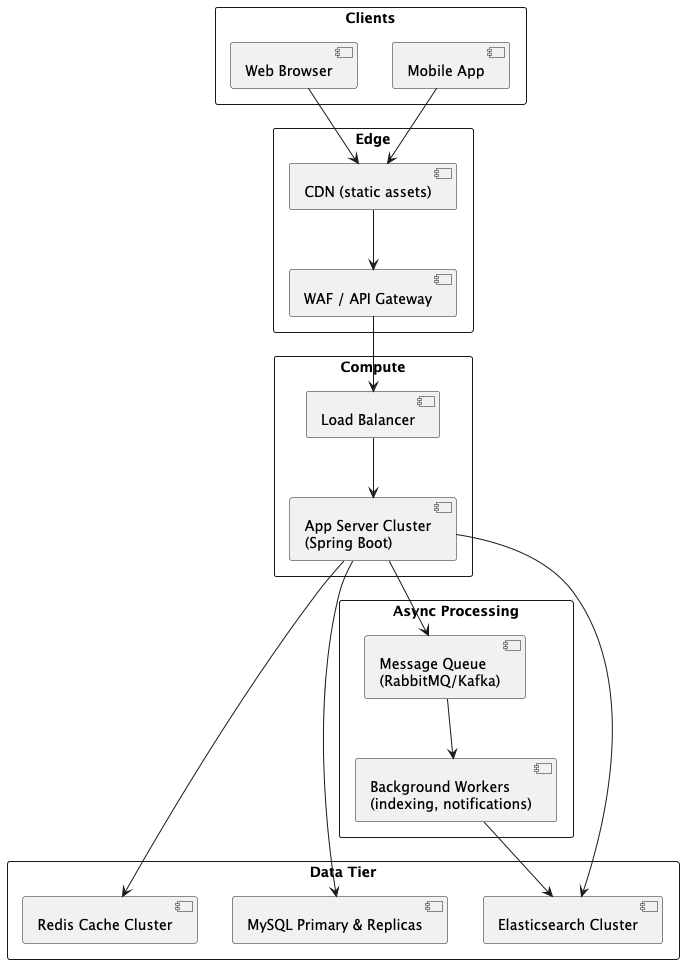

## Architecture Idea

  

### Component roles

#### Clients
* Web Browser  
Users accessing your blog via desktop browsers. Issues HTTP(S) requests for HTML/JS/CSS and consumes the JSON API for dynamic widgets or admin UIs.  
* Mobile App  
Native or hybrid mobile clients calling the same REST endpoints for posts, search, etc., perhaps with an embedded web-view for rich content.

#### Edge

* CDN — Caches static assets (images, JS/CSS)  
  * Caches and serves images, JavaScript, CSS, and any client-side bundles.  
  * Reduces load on origin servers and improves global latency.  
* WAF/API Gateway — Request filtering, rate-limiting, basic auth rules  
  * Filters malicious traffic (OWASP rules), enforces rate-limits, and provides a single point for TLS termination.  
  * Can also handle routing, API versioning, and simple authentication (e.g. JWT validation).

#### Compute

* Load Balancer  
  * Distributes incoming API traffic evenly across multiple Spring Boot app instances.
  * Performs health checks and can do SSL offload if not handled at the gateway.  
* App Server Cluster  
  * Stateless Java services implementing the REST endpoints (POST /posts, GET /posts, etc.).  
  * Uses Spring MVC, JPA, and integrates with Redis, MySQL, ES, and the message queue.

#### Data Tier  

* Redis Cache Cluster  
  * In-memory cache for hot reads: individual posts, recent post lists, or search results.  
  * Dramatically reduces database load and latency for majority read traffic.  
* MySQL Primary & Replicas  
  * Primary handles all writes (create/update/delete).  
  * Replicas handle read queries (e.g. initial post fetches) when cache misses occur.  
  * Ensures ACID guarantees for post data and referential integrity with categories/tags.  
* Elasticsearch Cluster  
  * Indexed copy of posts optimized for full-text search on title/content/category.  
  * Powers the GET /posts?term=… endpoint with fast, relevance-ranked results.

#### Async Processing

* Message Queue (RabbitMQ / Kafka)  
  * Decouples write path from expensive or long-running tasks: indexing, notifications, analytics.  
  * Accepts a message for every write operation (e.g. new post → index in ES).  
* Background Workers (indexing, notifications)  
  * Consume queue messages to update Elasticsearch indices, send email/webhook notifications, or recalculate tag usage stats.  
  * Can autoscale independently based on queue depth and processing time.

## Application Design

### About Post Tag
Challenge: _**how should we model “tags” so they’re searchable, maintainable, and prevent duplication?**_  
* Separate Tag entity: store each tag in its own table (tags) with a unique name column.  
* Many-to-many join: a post_tags bridge table links post_id ↔ tag_id.  
* Benefits:  
  * Centralized tag vocabulary—no “teck” vs “tech” typos.  
  * Fast lookup by tag (via indexed post_tags.tag_id).  
  * Ability to record tag metadata (e.g. usage count, createdBy, etc.).

### About Post Category
Challenge: `**should we keep “category” free-form or enforce a controlled list?**`  
* Category lookup table: store allowed categories in a categories table (id, name, optional description).  
* Foreign key on posts: each post’s category_id references categories.id.  
* Benefits:  
  * Prevents dirty/typo’d values.  
  * Enables category-level analytics (e.g. post counts per category).  
  * Easy to extend or retire categories via CRUD endpoints.

### About Post ID Generation
Challenge: _**how do we prevent easy enumeration of post IDs?**_  
Use a non-guessable ID—for example:  
* UUIDv4 (VARCHAR(36)) for full randomness  
* ULID ( I choose this) / Snowflake for roughly sortable, high-entropy IDs.

Expose the opaque ID in URLs (e.g. `GET /posts/01F8MECHZX3TBDSZ7XRADM79XE) instead of …/posts/123`.  
Benefits:  
* Protects user privacy by hiding sequence.  
* Makes it harder for malicious actors to crawl all posts.  

#### About ULID

##### Why ULID?
* URL-safe: ULIDs use Crockford’s Base32 alphabet (0–9 and A–Z without I/L/O/U), so you won’t hit any percent-encoding issues.  
* Lexicographically sortable: The 48-bit timestamp prefix means newer posts naturally sort after older ones if you ever need to do range scans or time-ordered queries.  
* Decentralized & collision-resistant: The 80-bit randomness gives you trillions of unique IDs per millisecond with virtually zero collision risk, without needing a central sequence.  
* Java support: There are battle-tested libraries (e.g. [ulid-creator](https://github.com/f4b6a3/ulid-creator)).  

If you wanted even shorter IDs, you could consider NanoID (URL-friendly by default), but you’d lose the built-in timestamp ordering. ULID strikes a nice balance for a production blogging API.  

##### How ULIDs work
* Timestamp prefix  
  * The first 48 bits of a ULID encode the millisecond-precision creation time.  
  * Any ULID generated at a later millisecond will always compare “greater” (lexicographically) than one generated earlier.  
* Randomness suffix  
  * The remaining 80 bits are cryptographically-secure randomness (or, in “monotonic” mode, a counter) to ensure uniqueness within the same millisecond.  
  * Without that random/counter component, if you generated two IDs in the exact same millisecond, they’d collide.  
* Sorting by ID = time order  
  * Because the time lives in the high-order bits, sorting ULID strings (ascending) yields posts in (approximate) creation order.  
  * In monotonic mode, even multiple ULIDs in the same ms remain ordered correctly, since the randomness is replaced by an incrementing value.  

Bottom line:  
* Uniqueness comes from the combination of timestamp + randomness (or counter).  
* Chronological ordering is a free side-effect: you can sort posts by their ULID to get them back in time order.

## Flow Process

### Read Path (Cache-Aside Pattern)
* Client issues `GET /posts/{id}`.  
* App first checks Redis for key post:{id}:  
  * Hit → deserialize and return immediately (sub–10 ms).  
  * Miss → fall back to MySQL (via Spring Data JPA):  
    ~~~
    Optional<Post> p = postRepo.findById(id);
    ~~~
* On a miss, after loading from MySQL, the app writes through into Redis (with a TTL, e.g. 5 min) so subsequent reads are cached:  
  ~~~
  redisTemplate.opsForValue().set("post:"+id, dto, Duration.ofMinutes(5));
  ~~~
* Return the post DTO to the client.

### Write Path & Cache Invalidation
When you create, update, or delete a post:  
* Write goes straight to MySQL primary via JPA (save(), deleteById()).  
* Immediately publish an event to the message queue (RabbitMQ/Kafka):  
  ~~~
  amqpTemplate.convertAndSend("posts.exchange", "post.updated", id);
  ~~~
* App responds with 201/200/204 to the client without waiting for indexing or cache work.  
* Async worker (separate process or thread pool) consumes the event and:  
  * Invalidates (evicts) any Redis entries for that post (DEL post:{id}) and, if you cache lists or searches, their keys too.  
  * Re-indexes the post document in Elasticsearch so that it immediately appears in search results.  

This gives you strong write performance (no sync waits) and eventual consistency for both cache and search index.

### Search Path
* Client hits `GET /posts?term=foo`.
* App uses Spring Data Elasticsearch to query ES:
~~~
  NativeSearchQuery q = QueryBuilders
    .multiMatchQuery(term, "title", "content", "category.name");
SearchHits<PostDocument> hits = esTemplate.search(q, PostDocument.class);
~~~
* ES returns matching documents (we typically index id, title, snippet, category, tags).
* Optionally, for full post data you can either:
    * Embed all needed fields in ES index and return them directly, or
    * Lookup full details in MySQL/Redis for each hit ID (slower, only if you need un‐indexed fields).

### Consistency & Performance Considerations

1. TTL + Cache Invalidation ensures stale data lives in Redis only briefly.  
2. Asynchronous indexing keeps write latencies low—search and cache catch up within milliseconds.  
3. Bulk re-indexing on deploy can rebuild ES from MySQL if needed (thanks to your postService.getAllPosts()).  
4. Monitoring (via Actuator + Metrics) tracks cache hit-rate, queue lag, DB QPS, ES indexing rate.

### Summary
~~~
Controller → Service → Orchestrator
      ↳ RedisCacheService (get/put/evict)
      ↳ JpaRepository (MySQL reads/writes)
      ↳ AmqpTemplate (publish write events)

AsyncWorker → @RabbitListener (or @KafkaListener)
      ↳ RedisCacheService.evict(postId)
      ↳ EsRepository.save(PostDocument)
~~~   
* Reads: Redis → MySQL (miss) → Redis populate → return  
* Writes: MySQL → MQ → Worker invalidates cache + updates ES → return to client  
* Searches: Elasticsearch query → return results (no DB hit)

This layered interaction gives you low-latency reads, high write throughput, scalable search, and clear separation of concerns between your Spring Boot service, MySQL, Redis and Elasticsearch.

## Lesson Learned

### Exception Handler
I create a `GlobalExceptionHandler` class, a Spring Boot component—annotated with @ControllerAdvice—that sits “above” all your @RestController endpoints and intercepts any uncaught exceptions, turning them into structured HTTP responses.

What it is and how it works?  
1. Centralized exception interception  
   - Declared with `@RestControllerAdvice`, it applies across every controller in your application.  
   - Methods annotated with `@ExceptionHandler` specify which exception types to catch (e.g. your `ApplicationException`, validation errors, or even `Exception` as a fallback).  
2. Consistent error payload  
   - Builds a uniform `ApiError` JSON object (timestamp, HTTP status, error text, message, request path, optional details).  
   - Ensures every error response follows the same schema, simplifying client-side parsing and documentation.  
3. Clear mapping to HTTP status codes  
   - For your custom exceptions (via `ApplicationException`), it reads the embedded `ErrorCode` and sets the proper status automatically.  
   - For validation failures (`MethodArgumentNotValidException`, `BindException`), it returns 400 with a list of field errors.  
   - A catch-all handler ensures any other uncaught exception becomes a 500 Internal Server Error, without leaking internal stack traces.

Why you need a `GlobalExceptionHandler`?  
* DRY error handling  
Without it, every controller (or service) would need boilerplate try/catch blocks to translate exceptions into HTTP responses. Centralizing eradicates repetition.  
* Separation of concerns  
Business logic stays focused on domain rules—throwing exceptions when things go wrong—while the handler deals solely with “how to present” errors to clients.   
* Consistent API contract  
Clients (mobile apps, front-ends, third-party integrations) can rely on a single, documented error schema instead of dealing with ad-hoc JSON or HTML error pages.  
* Easier observability and logging  
You can hook into the handler to log errors in a uniform way, enrich metrics, or trigger alerts for certain exception types, all in one place.  
* Future extensibility  
Need multi-language error messages, correlation IDs, or hints for remediation? You only update the handler (and ApiError), not dozens of controllers or service classes.

### About RedisCache
#### RedisTemplate vs RedisCache
For most CRUD‐style cache‐aside patterns—where you simply want “check cache → fallback to DB → populate cache” and “evict on write”—Spring’s Cache Abstraction (via @Cacheable/@CacheEvict) is usually the easier, more declarative choice:  

| Criterion                    | RedisTemplate + Manual Service      | Spring Cache Abstraction                         |
| ---------------------------- | ----------------------------------- | ------------------------------------------------ |
| Control over serialization   | Full, per–operation via RedisConfig | Central, via RedisCacheConfiguration             |
| Boilerplate in service layer | High (explicit get/put/evict calls) | Low (just annotate methods)                      |
| Fine–grained cache behavior  | Unlimited flexibility               | Annotations cover 90% of use–cases               |
| Metrics & monitoring         | You must instrument manually        | Built-in via Micrometer (cache hits/misses)      |
| Migration to clustered/HA    | Manual setup                        | Still manual, but all config in RedisCacheConfig |

##### When to pick RedisTemplate + Manual Service
* You need per‐entry TTLs, per‐operation differing key structures or eviction rules.  
* You’re doing complex operations (e.g. list/set/hashes) beyond simple key→value.  
* You need explicit control over serialization, expiration, or pipelining within your service logic.

##### When to pick Spring Cache Abstraction
* Your use‐case is simply cache this method’s return or evict that key on update/delete.  
* You want to minimize manual cache code and lean on Spring’s annotations.  
* You’d like built-in cache metrics (hit/miss ratios) without extra code.

##### In summary

* For simple cache‐aside on your service methods, go with Spring Cache Abstraction plus the configuration `RedisCacheConfig`.  
* If you have specialized caching logic (per‐request TTL, complex key math, reactive needs), stick with RedisTemplate and your service.

#### Why choose lettuce instead of jedis
Spring Boot’s choice of Lettuce over Jedis as the default Redis client is driven by several key advantages:  
1. Thread-safety & Connection Multiplexing  
   * Lettuce uses a single, Netty-based RedisClient instance that can safely be shared across multiple threads. Internally it multiplexes requests over a small number of TCP connections.  
   * Jedis, in contrast, requires you to manage a pool of separate connections (JedisPool) if you want to be thread-safe—otherwise you risk data corruption or exceptions when sharing a Jedis instance across threads.  
2. Non-blocking I/O & Reactive Support  
   * Lettuce is built on Netty and supports non-blocking I/O out of the box, making it a natural fit for both imperative and reactive (Spring WebFlux) applications.  
   * Jedis is purely blocking/block-per-connection, so it can’t be used in a reactive pipeline without costly thread-switching wrappers.  
3. Scalability Under High Concurrency  
   * With connection multiplexing, Lettuce maintains high throughput and lower resource usage under heavy concurrent loads—fewer sockets open, less pooling overhead.  
   * Jedis’s pool scales only by opening more connections, which increases memory and file-descriptor usage.  
4. Cluster & Sentinel Features
   * Lettuce has first-class support for Redis Cluster and Sentinel, handling topology changes, failover events, and slot migrations seamlessly.  
   * While Jedis also supports cluster and sentinel, its blocking model means failover events can block client threads.  
5. Simpler Configuration & Fewer Moving Parts  
   * With Lettuce you don’t need to configure and tune a separate pool—you just set spring.redis.lettuce.pool.* if you want pooling on top, but the default “single client” model often suffices.  
   * Jedis always requires a pool; missing or mis-configured pools can easily lead to resource exhaustion.

When might you choose Jedis instead?  
* Legacy codebases already tied to Jedis and its API.
* Simple scripts or one-off utilities where blocking I/O is fine and dependency size matters.  

But for a modern Spring Boot microservice—especially one that may grow into reactive or clustered deployments—Lettuce is the recommend choice for its performance, scalability, and feature set.

### Lombok Issues

#### Annotation Processor Error

When I run the test, Intellij complain about:
"java: variable postService not initialized in the default constructor"

How to solve  
1. Go to Settings → Build, Execution, Deployment → Compiler → Annotation Processors
2. Switch to “obtain processors from project classpath”

